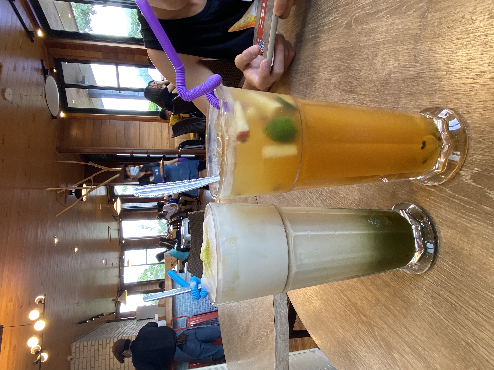

<table width="1000" border="0" cellpadding="0" cellspacing="1" bgcolor="#999999">
<tr>
              <td bgcolor="#FFFFFF">
              <a href="index.htm">作品集</a>　>　<a href="index.htm">食物</a>
　>　<a href="index.htm">好吃</a>
</td>
</tr>
</table>

 
<table border="1" width="1000" cellpadding="0" cellspacing="1" bgcolor="#999999">
<tr>
<td align="center" bgcolor="#FFFFFF" colspan="2" valign="center"><front size="36"><b>都是食物照片哦</b></front></td>
</tr>

<tr>
<td width="191" bgcolor="#FFFFFF" valign="top">
<table width="181" cellpadding="0" cellspacing="1">
<tr>選單列

<td align="center" valign="center"><a href="https://youtu.be/F4oHuML9U2A"target="-blank">Apink</a></td>
</tr>
<tr>

<td align="center" valign="center"><a href="https://youtu.be/WqzTRK5GPWQ"target="-blank">Apink</a></td>
</tr>
<tr>

<td align="center" valign="center"><a href="https://youtu.be/499YUeNoYVE"target="-blank">Apink</a></td>
</tr>
</td>
</table>
<td width="806" bgcolor="#FFFFFF" valign="top">
<table width="800" cellpadding="0" cellspacing="1">
<tr>
<td></td>
<td></td>
<td></td>
<td></td>
<td></td>
</tr>

<tr>
<td></td>
<td></td>
<td></td>
<td></td>
<td></td>
</tr>

<tr>
<td></td>
<td></td>
<td></td>
<td></td>
<td></td>
</tr>

</td>
</table>

</tr>

</table>

<footer>
曹洧洧&copy版權所有
</footer>

</body>
</html>
